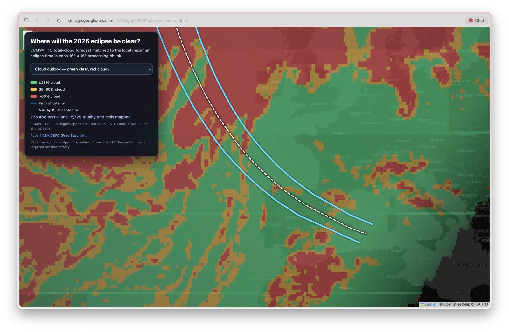
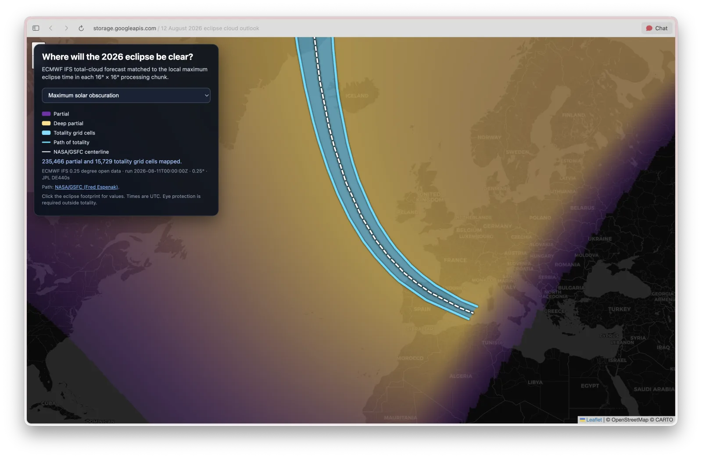
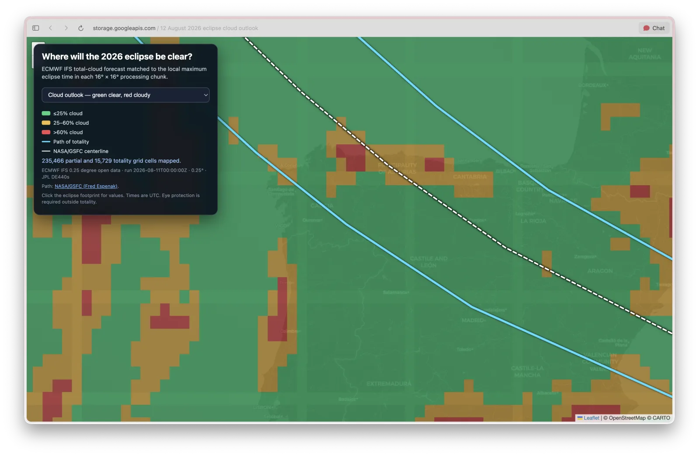
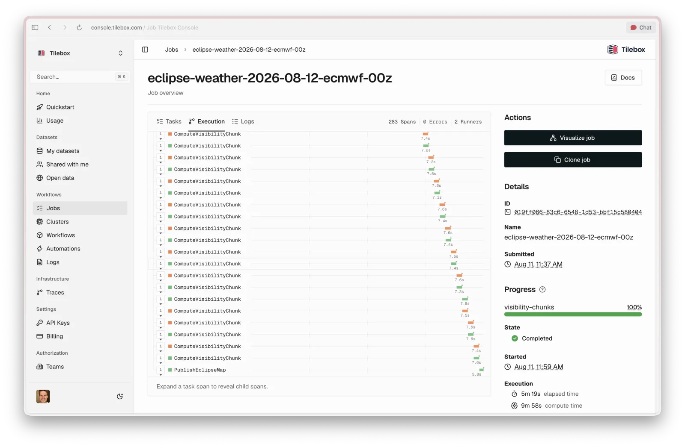

# Solar eclipse weather

This Tilebox workflow maps forecast cloud cover across the 12 August 2026 total and partial
solar eclipse. It produces a cloud-backed Zarr analysis cube, a seven-band Cloud Optimized
GeoTIFF, a GeoJSON totality corridor and centerline, a JSON manifest, and a
static Leaflet viewer.

## Live map

**[Open the interactive 12 August 2026 eclipse cloud outlook →](https://storage.googleapis.com/tilebox-hosted-compute-us-central1-results/solar-eclipse-weather/2026-08-12/ecmwf-20260811-00z/index.html)**

| Cloud outlook across Europe | Maximum solar obscuration |
| --- | --- |
| [](https://storage.googleapis.com/tilebox-hosted-compute-us-central1-results/solar-eclipse-weather/2026-08-12/ecmwf-20260811-00z/index.html) | [](https://storage.googleapis.com/tilebox-hosted-compute-us-central1-results/solar-eclipse-weather/2026-08-12/ecmwf-20260811-00z/index.html) |
| Cloud outlook along the path over Spain | Distributed workflow execution |
| [](https://storage.googleapis.com/tilebox-hosted-compute-us-central1-results/solar-eclipse-weather/2026-08-12/ecmwf-20260811-00z/index.html) |  |

## Data and method

- **Weather:** ECMWF IFS 0.25° open data, parameter `tcc` (total cloud cover), licensed
  under CC BY 4.0. The ECMWF range indexes let the workflow retrieve only the requested
  cloud-cover fields; a separate Tilebox dataset index is not necessary.
- **Astronomy:** JPL DE440s ephemeris. Solar/lunar topocentric geometry is sampled at five
  minutes and refined to 30 seconds around each grid cell's candidate maximum.
- **Grid:** EPSG:4326, 0.25° cells, 1440 × 360 pixels from 0–90° N. Forecast values are
  bilinearly centered from the native ECMWF point grid onto those cells.
- **Chunk matching:** the Zarr cube uses `(time=1, latitude=64, longitude=64)` forecast
  chunks. Each spatial chunk is matched to its median maximum-eclipse time and cloud cover
  is linearly interpolated between the bracketing 15:00, 18:00, and 21:00 UTC IFS layers.
- **Eclipse path:** the 12 August 2026 totality limits and centerline use the authoritative
  WGS84 coordinates published at two-minute intervals by Fred Espenak for NASA/GSFC. This
  preserves the physical sunrise and sunset limits; other dates fall back to a corridor and
  approximate centerline derived from the 0.25° eclipse-class grid.
- **Viewer:** the weather COG is rendered at 65% layer opacity so map labels and coastlines
  remain visible beneath it. The totality path is rendered separately at full opacity.

The COG bands are:

1. Eclipse obscuration in hundredths of a percent.
2. Matched total cloud cover in hundredths of a percent.
3. Clear-sky fraction in hundredths of a percent.
4. Maximum eclipse UTC minute of day.
5. Eclipse class (`1=partial`, `2=total`).
6. Effective forecast UTC minute of day.
7. Sun altitude plus 90°, in hundredths of a degree.

## Run locally

Install [uv](https://docs.astral.sh/uv/) and the
[Tilebox CLI](https://docs.tilebox.com/cli), provide a `TILEBOX_API_KEY`, and authenticate
with Google Cloud once:

```bash
export TILEBOX_API_KEY="..."
gcloud auth application-default login
```

Start the workflow runner:

```bash
uv run runner.py
```

In a second terminal, submit the workflow:

```bash
tilebox job submit \
  --name eclipse-weather-2026-08-12 \
  --task tilebox.com/solar-eclipse-weather/RunEclipseWeather \
  --version v1.3 \
  --cluster gcp-Drv6L7Li4t7Yvk \
  --input '{
    "event_date":"2026-08-12",
    "forecast_run_date":"2026-08-11",
    "forecast_run_hour":0,
    "output_prefix":"solar-eclipse-weather/2026-08-12/ecmwf-20260811-00z",
    "forecast_source":"google",
    "verify_tls":true
  }' \
  --wait
```

The workflow downloads the free ECMWF forecast data and JPL ephemeris on first use. It
requires access to the `tilebox-hosted-compute-us-central1-results` GCS bucket and writes
the public viewer to `index.html` under the requested output prefix.

Run the test suite with `uv run pytest`.
